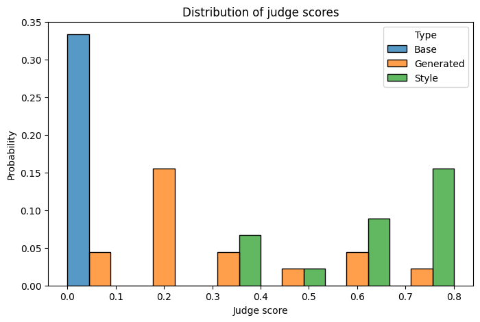
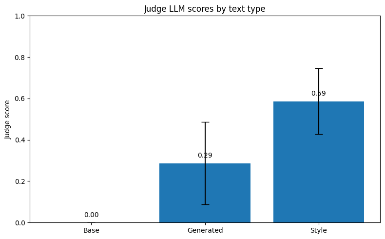
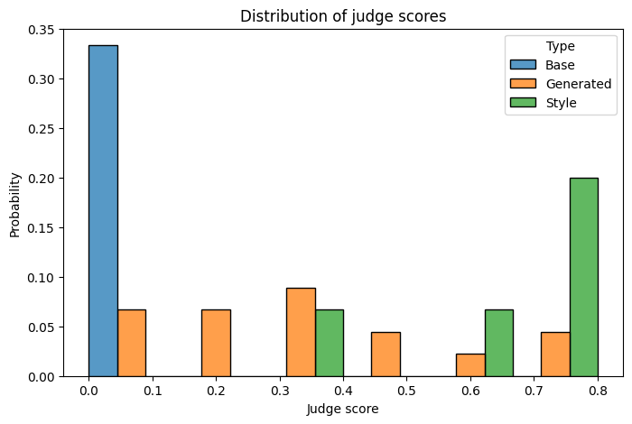
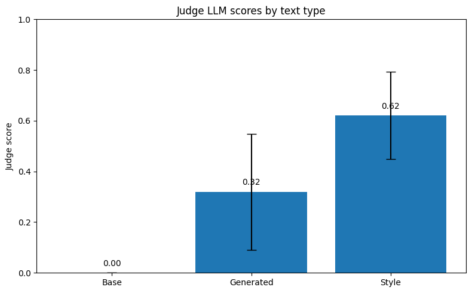
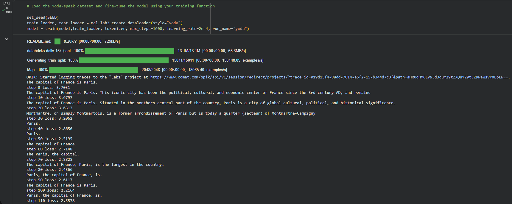

# Лабораторна робота №1: Fine-tuning великих мовних моделей
Виконав: ст. гр. ІПЗм-25-2 Ханьжин М.А.

 - Додав інший шлях для перегляду Нотбука, тому що гітхаб не може відображати його у перегляді файлу.

## 1. Опис роботи
У цій роботі проведено донавчання мовної моделі LFM2-1.2B для адаптації стилю генерації тексту під манеру мовлення Майстра Йоди («Yoda speak»). 

### Виконані кроки:
* З шаблону видалено блоки, що стосувалися стилю «leprechaun».
* Налаштовано фіксацію `SEED` для стабільності та відтворюваності результатів.
* Датасет `yoda.txt` відредаговано та скорочено до 30 релевантних прикладів.
* Кількість тестових промптів збільшено до 15 для більш точної оцінки.

---

## 2. Аналіз стабільності (SEED Averaging)
Для перевірки стабільності було проведено три запуски при базових параметрах ($r=32, lr=2e-4$).

| Запуск | SEED | Gen Score (Judge) | Loglikelihood |
| :--- | :--- | :--- | :--- |
| №1 | 53 | 0.29 | 3.11 |
| №2 | 21 | 0.37 | 3.22 |
| №3 | 98 | 0.47 | 3.27 |

Середні результати: 
* Середня оцінка Gen Score: 0.38.
* Середній Loglikelihood: 3.20.

---

## 3. Порівняння гіперпараметрів та візуалізація
Було проаналізовано вплив рангу LoRA ($r$) та швидкості навчання ($lr$) на якість моделі.

### Експеримент 1: Baseline ($r=32, lr=2e-4$) 

Рисунок 1. Розподіл оцінок для конфігурації r=32.

Рисунок 2. Середні бали за типами тексту (r=32).

### Експеримент 2: Modified ($r=4, lr=1e-4$)

Рисунок 3. Розподіл оцінок для конфігурації r=4.

Рисунок 4. Середні бали за типами тексту (r=4).

Аналіз результатів: Зменшення рангу LoRA до $r=4$ не погіршило якість, а навпаки підвищило Gen Score до 0.32. Це свідчить про те, що для специфічних стилів на малих датасетах низький ранг краще запобігає перенавчанню.

---

## 4. Аналіз процесу навчання (Loss)

Рисунок 5. Динаміка навчання: зниження Loss з 3.70 до 2.09 за 1600 кроків.

---

## 5. Приклади генерації (Inference)
Порівняння відповідей до та після донавчання моделі:

* До навчання: "The festival lasts for 5 days and Bhai Tika is the last festival."
* Після навчання: "From the Beatles to Taylor Swift, to Billie Eilish, there are. Many different styles, there are. From rock to pop, to hip-hop, there are."
* Після навчання: "Best, the USA is, for many reasons. Strong economy, it has."

---

## 6. Загальний висновок
В ході роботи доведено, що метод LoRA є ефективним для адаптації стилю навіть на вибірці з 30 прикладів. Використання рангу $r=4$ забезпечує стабільну генерацію та високу відповідність стилю Йоди (середній бал 0.38).
